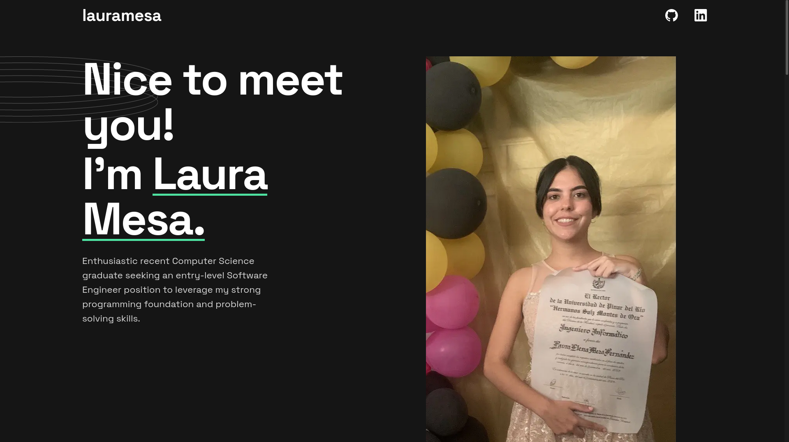

# Frontend Mentor - Single-page developer portfolio solution

This is a solution to the [Single-page developer portfolio challenge on Frontend Mentor](https://www.frontendmentor.io/challenges/singlepage-developer-portfolio-bBVj2ZPi-x). Frontend Mentor challenges help you improve your coding skills by building realistic projects. 

## Table of contents

- [Overview](#overview)
  - [The challenge](#the-challenge)
  - [Screenshot](#screenshot)
  - [Links](#links)
- [My process](#my-process)
  - [Built with](#built-with)
  - [What I learned](#what-i-learned)
  - [Continued development](#continued-development)
  - [Useful resources](#useful-resources)
- [Author](#author)

## Overview

Portfolio with a brief description about me, a list of projects I have done or collaborated on, and my programming skills.

### The challenge

Users should be able to:s

- View the optimal layout for the interface depending on their device's screen size
- See hover and focus states for all interactive elements on the page
- **Bonus**: Add your own details (image, skills, projects) to replace the ones in the design

### Screenshot

### Links

- Live Site URL: [(https://portfolio-app-three-red.vercel.app/)]

## My process

### Built with

- Semantic HTML5 markup
- CSS custom properties
- Flexbox
- Mobile-first workflow
- [Tailwind CSS](https://tailwindcss.com/) - CSS Framework
- [React](https://reactjs.org/) - JS library
- [Next.js](https://nextjs.org/) - React framework

### What I learned

This was my first time working on a project with Next JS and I learned about routing and how to work with components.

### Continued development

This was a small project and I would like to go much deeper into this React framework.

### Useful resources

- [Example resource 1](https://nextjs.org/docs) - This helped me for learning how to start developing with Next JS.

## Author

- Frontend Mentor - [@laurymesa01](https://www.frontendmentor.io/profile/laurymesa01)
- LinkedIn - [@lauraelenamesa](https://www.linkedin.com/in/lauraelenamesa/)

